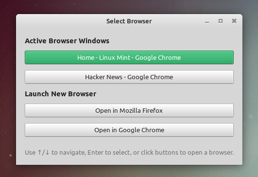

# **Browser Picker Script**



## **Overview**

The **Browser Picker Script** allows you to dynamically select which browser to use when opening links in Linux. So if you click on a link in a terminal, application or a notification, it will open in the browser you select. It's useful if you use multiple browsers or browser profiles such as chrome profiles and want to open links in a specific browser each time. It's been tested in Linux Mint with Cinnamon Desktop but should be fine on Ubuntu and Debian as well.

### **Problem it solves**

- You have different browsers or browser profiles for work and personal use and want to open links in the correct browser

### **Key Features**
- Dynamically choose between active browser windows (e.g., Chrome, Firefox).
- Support for opening URLs in new browser instances if no active windows are found.
- Fully configurable to set as the default browser for your system.

---

## **Installation**

### **Prerequisites**

1. **Browsers**
   - **Google Chrome**: Download and install from [Google Chrome Official Website](https://www.google.com/chrome/)
   - **Mozilla Firefox**: Install via package manager:
     ```bash
     sudo apt install firefox
     ```

2. **Dependencies**
   ```bash
   sudo apt install python3 python3-gtk-4-0 xdotool
   ```

### **Setup Steps**

1. **Download and Save the Script**
   - Save `browserpicker.py` in a directory (e.g., `~/bin/`)
   ```bash
   mkdir -p ~/bin
   # Copy browserpicker.py to ~/bin/
   # Note: browserpicker_tkinter.py is kept for legacy support
   ```

2. **Make the Script Executable**
   ```bash
   chmod +x ~/bin/browserpicker.py
   ```

3. **Create Desktop Entry**
   Create the file `~/.local/share/applications/browserpicker.desktop`:

   Add the following contents (replace `<your-username>`):
   ```ini
   [Desktop Entry]
   Version=1.0
   Name=Browser Picker
   Comment=Select which browser to use
   Exec=/usr/bin/env python3 /home/<your-username>/bin/browserpicker.py %u
   Terminal=false
   Type=Application
   Icon=web-browser
   Categories=Network;WebBrowser;
   MimeType=x-scheme-handler/http;x-scheme-handler/https;
   ```

4. **Update Desktop Database**
   ```bash
   update-desktop-database ~/.local/share/applications/
   ```

5. **Set as Default Browser**
   ```bash
   # Set as default browser
   xdg-settings set default-web-browser browserpicker.desktop
   
   # Associate with HTTP(S) URLs
   xdg-mime default browserpicker.desktop x-scheme-handler/http
   xdg-mime default browserpicker.desktop x-scheme-handler/https
   ```

6. **Verify Installation**
   ```bash
   xdg-settings get default-web-browser
   # Should output: browserpicker.desktop
   ```

## **Usage**

### **Basic Usage**
Run the script directly with a URL:
```bash
./browserpicker.py https://example.com
```

### **Interface**
The Browser Picker provides an intuitive GTK4-based GUI with the following features:

- **Active Window Selection**: Shows all currently open browser windows
- **New Browser Options**: Launch new instances of installed browsers
- **Keyboard Navigation**:
  - `↑`: Select previous option
  - `↓`: Select next option
  - `Enter`: Open URL in selected browser/window

### **Supported Browsers**
- Mozilla Firefox
- Google Chrome (includes profile picker support)

## **Configuration**

### **Adding Additional Browsers**

The script can be configured to support other browsers like Brave. Simply modify your `browserpicker.py`:

```python:browserpicker.py
# Modify these variables to add support for additional browsers
self.BROWSERS = {
    "Mozilla Firefox": "firefox",
    "Google Chrome": "google-chrome",
    "Brave Browser": "brave-browser"  # Add additional browsers here
}
```

The dictionary key is the name of the browser that will be displayed in the GUI. The value is the command to launch the browser.

The browser command should match the executable name in your system PATH.

## **Technical Details**

- Uses `xdotool` for window management and keyboard simulation

## **Contributing**

Feel free to submit issues, fork the repository, and create pull requests for any improvements.

---

## **Troubleshooting**

### Common Issues
2. **Browser not launching**
   - Verify browser executables are in your system PATH
   - Check that browser packages are properly installed

3. **Keyboard shortcuts not working**
   - Ensure no conflicts with system shortcuts
   - Verify tkinter installation is complete

---

## **Credit**

The original code and idea was inspired by a Stackoverflow answer done using tkinter. I can't remember the link to before I added new features. If you know the original answer, please let me know so I can credit you! The tkinter version is kept in `browserpicker_tkinter.py` but I won't be updating it.
